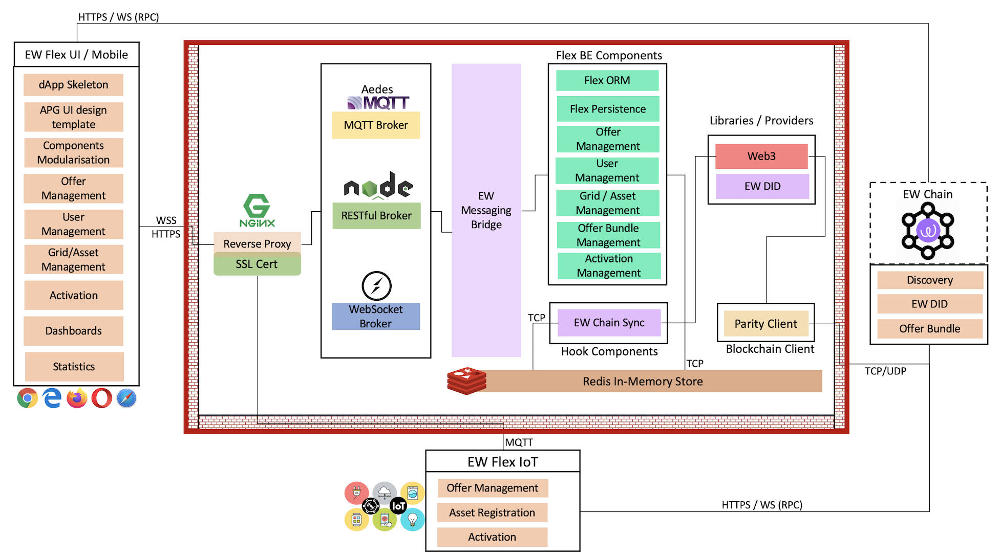
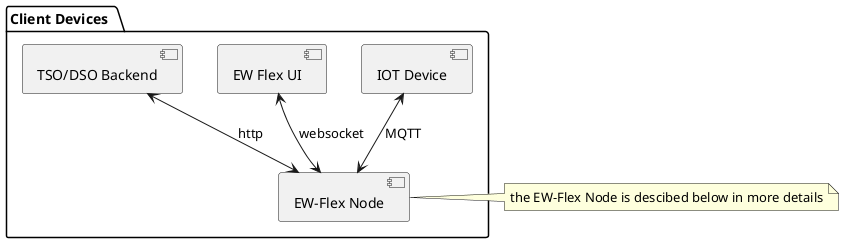
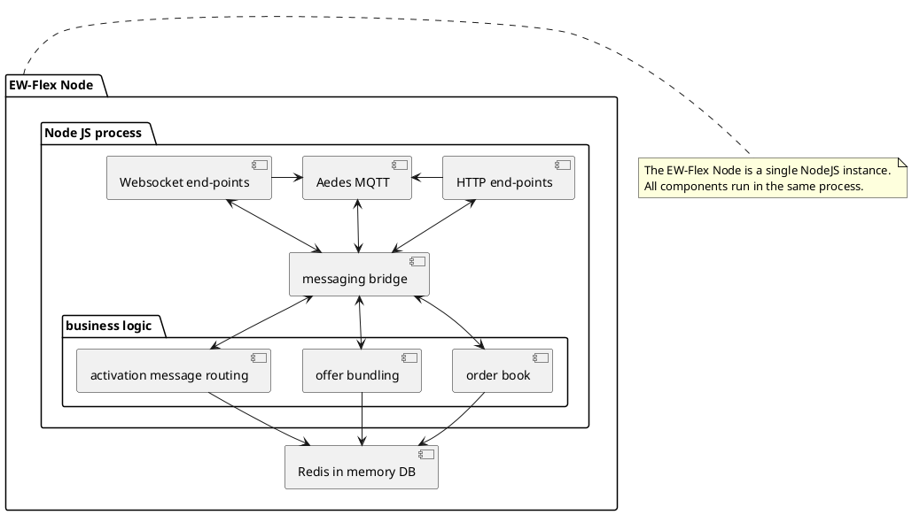
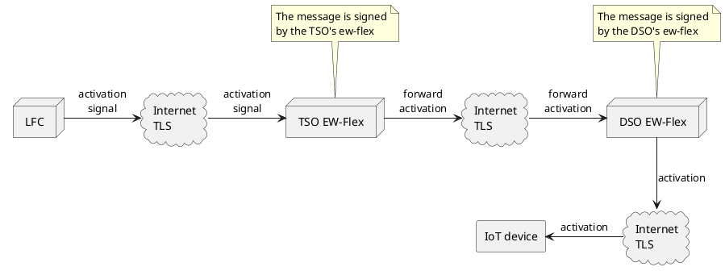

# EW Flexibility

Flexibility (Highlighted in Red)

## Components

## Scaling

The ew-flex has been designed to scale both internally and as a whole. The goal is to enable the connection of as many IoT devices as possible to a single EW-Flex instance (100K is the current theoretical limit) while enable a virtually unlimited number of devices to participate in the marketplace when clustering the EW-Flex nodes themselves.

### Sizing

The EW-Flex node must be run on an adequate infrastructure with good internet connectivity in order to perform as expected. The minimum requirements for a deployment are:

* For the EW-Flex (MQTT, HTTP and WS) hosting all the Business Logic Components
  * 4 CPU cores
  * 16 GB of memory
  * Gigabit Internet
  * 10 Gigabit LAN
  * SSD Storage for persistence
* [For the Redis In Memory database](https://docs.redislabs.com/latest/rs/administering/designing-production/hardware-requirements/#production-environment-hardware-requirements)
  * 8 CPU cores
  * 32 GB of memory
  * Gigabit Internet
  * 10 Gigabit LAN
  * SSD Storage for persistence

Each node will run at least two nodeJS processes (for high availability) and two redis nodes: one master and one slave.

All elements must be located on the same LAN in order to have low latency, high throughput connection.

### Assumptions

In order to make measurements and test the infrastructure we make the following assumptions:

* 10 minutes dynamic bundling period
* the bundler runs every 5 seconds = 120 bundling rounds
* 1'000'000 million IoT devices
* 10 EW-Flex nodes operated by 9 DSOs and 1 TSO. Each ew-flex node is run in a different data centre
* 1'000'000 IoT device offers for each delivery period with 10 updates for each offer
* 100 Requests form each DSO/TSO = 1'000 Requests overall with 120 updates to each request

### Performance measurement

In this section we describe the elements which are critical to the EW-Flex's performance and what part of the solution put a strain on what kind of resouce.

#### Network

The network is the determining resource in the ew-flex. The data volume is not the challenge, rather the number of concurrent connections. Each IoT device needs to keep an open connection with the ew-flex in order to receive activation messages which need to be sent with minimal latency at a 2s interval.

Some testing needs to be performed but the documentation and benchmarking suggest that we can safely assume 10K concurrent connections per EW-Flex NodeJS process. As the Redis node runs on the LAN there is no reason to assume it would not be able to cope with whatever number of concurrent clients are connected to the EW-Flex Node. Indeed, Redis has been successfully tested with 100K writes per second and it is the offers from the devices which need to be written. Not the activation messages.

An activation message takes 50ms to reach the device (this depends on network topology of course) and the device requires 100ms to verify the signature on the device.

We can thus safely assume that the latency for an activation message from the ew-flex to the IoT device is below 200ms. Adding to this an additional 200ms of latency between the LFC and the EW-Flex (which is a very pessimistic estimate) and we are still well below the 1s required for a safe activation message every 2s.

#### CPU

The EW-Flex does not have a high demand on computing performance. Indeed, there are no complex computations in any of the components. As there are no complex queries and dedicated components can be used for time critical computations like hashing and encryption or decryption, there is no part of the solution which can be slowed down by the CPU resouces available, as long as the suggested minima are available.

#### Memory

As the Redis database is kept 100% in memory and only persisted to disk for recovery functionality, there needs to be enough RAM to hold the data. The data in question are the offers and requests for the next delivery period as well as the bundles for the current delivery period. Everything else can be archived.

This means that the worst case scenario is 2mio offers from the devices and maybe 10'000 requests from the TSO and DSO. Which is less than 1GB even if we increase the message sizes by an order of magnitude. The 32GB of required memory are to enable seamless queries at high performance.

### Scaling parameters

The default installation with 2 nodejs processes and a redis cluster can handle approximately 10K IoT devices. It is the nodejs Aedes component which represents the bottleneck of the installation. Indeed, tests have shown increased CPU and memory usage with more than 10K active connections.

The good news is that creating a cluster of 100 nodeJs processes is not rocket science and a single installation can therefore easily handle 1mio devices through a reverse proxy.

#### Message routing

The goal of the ew-flex is to allow a decentralized modus operandi. Therefore, it is important that not all the IoT devices be connected to the same node. Additionally, it can happen that an actor purchases flexibility from a device which is not connected to the node it operates. Actually, as AFRR is a product solely purchased by the TSO, none of the devices will be connected to the actor's node as the TSO has no direct relationship with the prosumer.

In order to sill allow the node operator to act as a virtual power plant, the activation messages it receives need to be routed to the ew-flex node to which the device is connected. As every offer contains the ew-flex node which has received it, it is easy to route the message to the right node.

The routing of the message can happen very quickly as there is a single hop from the node receiving the activation signal from the LFC and the node to which the IoT device is connected.

#####  The process looks like this:

When the IoT device responds with the base line, the message is rerouted to the TSO in reverse.

#### Redis

Redis is an in memory database which has been built with caching functionality in mind. As Redis stores all its data in memory it is blazingly fast and will not represent a bottleneck in the ew-flex.

We use Redis' replication mechanism to make sure that an offer written on one ew-flex node gets also stored on all the others. The latency of the replication is dependent on the network topology but we assume that it will be below 5s with up to 100 ew-flex nodes. Preliminary tests have shown this timing to be a pessimistic estimate for the data volume handled by the ew-flex.

